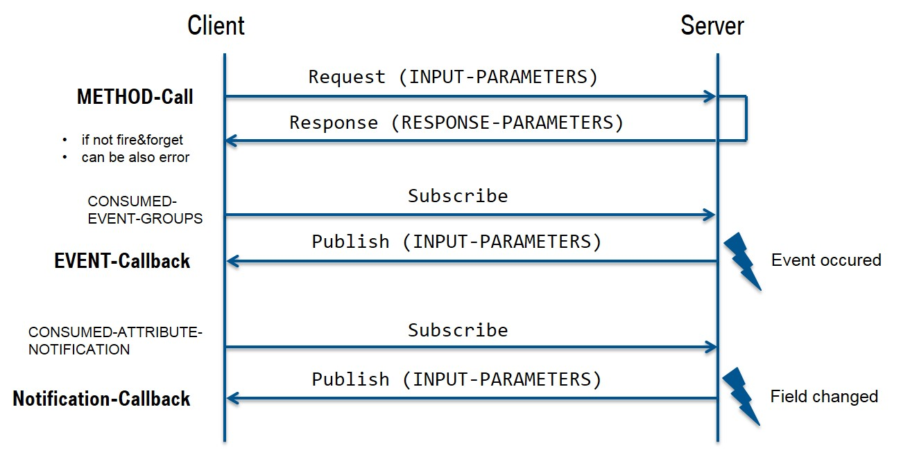
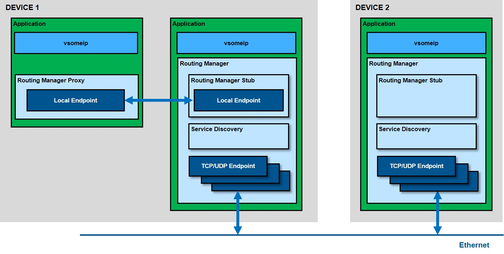

(( 간단 번역 from : https://github.com/GENIVI/vsomeip/wiki/vsomeip-in-10-minutes ))

((번역 Note))
1. 원문이 어려운 영어가 아닌데, 반복해서 읽는 데 시간도 걸리고, 돌아서면 까먹는 기억력이라 좀 더 기억하려고 만든 페이지...
1. compile 된 program 을 app 이라고 표현하였는데, 쓰다 보니 SOME/IP 에서 사용하는 application 이라는 용어와 겹쳐서 혼동이 좀 있다.  다시 쓰기도 귀찮고...  혼동하지 말자.
1. SOME/IP 는 보통 한 node 가 client / server 중 하나의 역할만 하는 게 아니라, 동시에 두 역할을 할 수 있고, 아마 아무 센서라도 있는 major ECU 라면 다들 그렇게 동작할 듯?

# vsomeip in 10 minutes
## 목차
* SOME/IP 소개
* SOME/IP On-Wire Format
* SOME/IP Protocol
* SOME/IP Service discovery (SD)
* vsomeip Short Overview
* Preparation / Prerequisites
* First Application
* Availability
* Request / Response
* Subscribe / Notify
* Communication between two devices

## SOME/IP Short Introduction
SOME/IP 은 "Scalable service-Oriented middlewarE over IP" 의 약자이다.  이 middleware 는 (적어도 wire-format level 에서) AUTOSAR 호환 가능한 typical automotive use case 를 위해 디자인되었다.
일반에 공개된 spec 은 http://some-ip.com 에 있다.  여기서는 middleware spec 에 대해서 깊게 살펴보지는 않을 거지만, 대략적인 SOME/IP 의 기본 구조와 its open source (without any claim of completeness) 인 vsomeip 에 대해 rough overview 할 것이다.
SOME/IP 세 개의 기본 파트로부터 시작해 보자.

1. On-wire format
1. Protocol
1. Service Discovery

### SOME/IP On-Wire Format
원칙적으로 SOME/IP 통신은 device 간 혹은 subscriber 간 IP 통신을 통해 전송되는 메세지들로 이루어진다.  아래 그림을 보자 : 


두 device (A, B) 에서, A 가 SOME/IP msg 1개를 B 에게 보내고 1개를 회신받는다.  이 통신은 TCP or UDP 위에서 동작한다.
이제 B 가 A 에서 호출하면 메세지를 회신하는 service 를 돌린다고 가정해 보자.
SOME/IP 는 헤더와 payload 를 가지는데 그림에서 header 는 주로 아래와 같은 ID part 들로 구성되어 있다 :

* Service ID : : Service ID
* Method ID : 0-32767 for methods, 32768-65535 for events
* Length : payload 바이트 길이 (다음에 있는 header 의 8 byte ID 포함 (*주: payload + header 의 이 다음 8 byte 포함한다는 의미) )
* Client ID : client ID; 차량 네트워크에서 유일해야 함.
* Session ID: ID for session handling; 호출 시마다 증가해야 함.
* Protocol Version: 0x01
* Interface Version: major version of the service interface
* Message Type: 
   - REQUEST(0x00)            : A request expecting a response (even void)
   - REQUEST_NO_RETURN(0x01)  : A fire&forget request
   - NOTIFICATION (0x02)      : A request of a notification/event callback expecting no response
   - RESPONSE (0x80)          : The response message
* Return Code: 
   - E_OK(0x00)                      : No error occurred 
   - E_NOT_OK(0x01)                  : An unspecified error occurred 
   - E_WRONG_INTERFACE_VERSION(0x08) : Interface version mismatch 
   - E_MALFORMED_MESSAGE(0x09)	     : Deserialization error, so that payload cannot be deseria-lized 
   - E_WRONG_MESSAGE_TYPE(0x0A)	     : An unexpected message type was received (e.g. REQUEST_NO_RETURN for a method defined as REQUEST)

일반적인 function call 에 대해서는 "REQUESTs" and "RESPONSEs" 가 있고, client 가 subscribe 한 event 에 대해서는 notification msg 가 있다는 것을 확인할 수 있다.
Error 는 error return code 와 함께 response 나 noti 로 리포트된다.
payload 는 user data 를 구성한다. 위 그림은 simple case 에 대한 간단한 serialization, 즉 기본 데이터 타입들로만 구성된 nested structure 를 보여주고 있다.
struct elements 가 그냥 순서대로 죽 나열되어 있는 쉬운 예이다.

### SOME/IP Protocol
이 섹션에서는 두가지 주요 포인트가 있다: 
* Transport Binding 이라 불리는 것 (UDP and TCP)
* 기본 통신 패턴의 publish/subscribe request/response

앞서 기술한 것처럼 기본 통신은 UDP or TCP 이다.  
UDP 의 경우 SOME/IP msg 가 fragment 되지 않는다.  하나 이상의 메세지가 UDP packet 내에 있을 수 있지만, 하나의 메세지가 UDP package 길이보다 길 수는 없다(up to 1400 bytes). 이것보다 길다면 TCP 를 통해 보내져야만 하고, TCP 의 robustness feature 가 사용된다.  만일 TCP stream 의 sync 에러가 발생한다면 SOME/IP spec 은 next msg 의 시작점을 찾기 위해 magic cookie 라고 불리는 걸 사용하는 걸 허용한다. 
Service Interface 는 반드시 인스턴스화되어야 하는데, 왜냐하면 보통 같은 인터페이스를 다수의 service instance 가 있기 때문이다.  이 때 instance 들은 당연히 unique 한 다른 ID 를 가져야 하는데, 주의할 점은 Instance ID 는 SOME/IP 의 헤더에 있는 정보가 아니라는 것이다.  instance ID 는 Transport protocol 과 port number 를 통해 identified 된다.  즉 다시 말해, 같은 interface 를 통해 다수의 instance 를 제공하려면 각기 다른 포트를 사용해야 한다.

SOME/IP 통신의 기본 패턴을 보여주는 아래 그림을 보자 : 


원격 호출을 위한 표준 Req/Res mechanism 에 더해, events 를 위한 PUBLISH/SUBSCRIBE 패턴도 볼 수 있다.  SOME/IP protocol 의 events 는 항상 event group 에 묶여 있다는 것을 주지하자.  다시 말해 event group 을 subscribe 하는 것이 가능하지, 개별적인 event 를 subscribe 하는 것은 허용되지 않는다.
SOME/IP spec 은 "fields" 에 대해서도 기술하고 있다.  이 그림에서 REQ/RSP 패턴과 EVENT 패턴 뒤에 setter/getter method 가 오고 있는 것을 볼 수 있는데(*주: Notification Callback 이라고 표시된 부분) 이것에 대한 subscription 은 SOME/IP 의 SD 를 통해 이루어진다.


### SOME/IP Service discovery (SD) 
SOME/IP SD 는 service instance 를 배치하고(*주: 서버쪽), Publish/Subscribe handling 을 구현/동작하는 service instance 를 찾기 위한(*주: client 쪽) 것인데, message offer 라고 이름 붙인 것을 통해 이루어진다.
이 의미는 각 device 들이 자기가 제공하는 all service 들에 대한 정보를 broadcast (multicast) 한다는 것이다.  <u>SOME/IP SD msg 는 UDP 를 통해 전송된다.</u>
만일 client app 에서 필요한 서비스가 그 시점에서 아직 offer 되지 않은 상태라면, client 가 "find msg" 를 보낼 수도 있다.  Other SOME/IP SD messages can be used for publishing or subscribing an eventgroup.

아래 그림은 SOME/IP msg 의 general structure 를 보여준다 :


이상으로, 기본에 대해 알아 보았다.  보다 상세한 내용은 후술할 예제나 실제 사양서를 통해 알아보도록 하자.

## vsomeip Short Overview
입문 예제를 시작하기 전에, GENIVI 의 SOME/IP 기본 구현인 vsomeip 구조에 대해 살펴보자.


그림에서 보면, vsomeip 는 외부 device 간 SOME/IP 통신을 커버하는 것 뿐만 아니라 IPC 도 커버하고 있다. (*주: 이게 windows porting 을 힘들게 한다...)
통신하는 두 device 를 communication endpoints 라고 하고, 이 device 들은 transport protocol (UDP or TCP) 과 port number 를 비롯한 parameter 들을 결정한다.
이 파라미터들은 configuration parameter 라고 부르는데, vsomeip configuration file (json file 포맷이며, vsomeip user guide 참조) 에서 세팅할 수 있다.
IPC 는 Boost.Asio Library 를 사용한 UDS (Unix Domain Socket) 을 사용하여 구현되었다.  이 IPC 는 centrol component (e.g: D-Bus Daemon) 를 통한 route 방식이 아니기 때문에 매우 빠르다.
centrol vsomeip routing manager 는 외부 device 로 메세지를 보내야 할 때만 msg 를 받으며, 외부로부터 오는 msg 는 받아서 내부로 distribute 한다.  routing manager 는 device 당 1개만 있어야 하는데, vsomeip 의 default 세팅은 첫번째 vsomeip app 가 실행될 때 routing manager 가 실행되도록 되어 있다.

:exclamation: vsomeip 는 data structure 의 serialization 을 구현하지 않았다!!  이건 CommonAPI 의 SOME/IP 에서 커버된다.  vsomeip 는 SOME/IP protocol 과 SD 만 커버한다.

이것으로 매우 간단하게 SOME/IP 와 vsomeip 에 대해 리뷰해 보았다.  그러나 시작해 보기엔 충분하다.  더 자세한 내용은 예제를 통해 설명하겠다.

### Preparation / Prerequisites
앞서 말한 것처럼 vsomeip 는 Boost.Asio 라이브러리가 필요하니, BOOST library (v1.55 이상) 를 깔았는지 확인해야 한다.  Boost library 가 정상 설치되었다면, 문제없이 vsomeip 를 아래와 같이 쉽게 설치할 수 있을 것이다: 

```shell
$ cd vsomeip
/vsomeip$> mkdir build
/vsomeip$> cd build
/vsomeip/build$> cmake ..
/vsomeip/build$> make
```
이렇게 해도 동작하지만, 이후 발생할 수 있는 다른 문제를 피하기 위해 아래와 같은 parameter 를 추가하여 Cmake 를 호출하길 추천한다.

```shell
/vsomeip/build$> cmake -DENABLE_SIGNAL_HANDLING=1 ..
```
이 파라미터는 vsomeip app 을 문제없이 kill 할 수 있도록 도와준다. (otherwise it might be that the shared memory segment /dev/shm/vsomeip is not be correctly removed when you stop the application with Ctrl-C).

### First Application
첫번째 vsomeip app 을 만들고, service-example 이라고 하자: 

_service-example.cpp_
```shell
#include <vsomeip/vsomeip.hpp>

std::shared_ptr< vsomeip::application > app;

int main() {

    app = vsomeip::runtime::get()->create_application("World");
    app->init();
    app->start();
}
```

매우 간단하다: init() method 는 app 을 만들고 난 뒤 호출되어야 하는데, 아래와 같은 step 을 실행한다:
* Loading the configuration
* Determining routing configuration and initialization of the routing
* Installing signal handlers

start() method 는 init() 다음에 호출되어야 한다.  수신된 msg 는 socket 과 등록된 callback 함수를 통해 처리된다.

이제 App 을 빌드하기 위해 CMake file 을 아래와 비슷하게 만들어 보자 :
_CMakeLists.txt (Example)_
```shell
cmake_minimum_required (VERSION 2.8)

set (CMAKE_CXX_FLAGS "-g -std=c++0x")

find_package (vsomeip 2.6.0 REQUIRED)
find_package( Boost 1.55 COMPONENTS system thread log REQUIRED )

include_directories (
    ${Boost_INCLUDE_DIR}
    ${VSOMEIP_INCLUDE_DIRS}
)

add_executable(service-example ../src/service-example.cpp)
target_link_libraries(service-example vsomeip ${Boost_LIBRARIES})
```

build dir 을 만들고 CMake 를 run / build 한 뒤, 실행해 보자. (service-example).  정상적으로 빌드되었다면 아래와 같은 출력을 볼 수 있다:
```shell
2017-03-20 10:38:20.885390 [info] Parsed vsomeip configuration in 0ms
2017-03-20 10:38:20.889637 [info] Default configuration module loaded.
2017-03-20 10:38:20.889797 [info] Initializing vsomeip application "World".
2017-03-20 10:38:20.890120 [info] SOME/IP client identifier configured. Using 0001 (was: 0000)
2017-03-20 10:38:20.890259 [info] No routing manager configured. Using auto-configuration.
2017-03-20 10:38:20.890367 [info] Instantiating routing manager [Host].
2017-03-20 10:38:20.890641 [info] init_routing_endpoint Routing endpoint at /tmp/vsomeip-0
2017-03-20 10:38:20.890894 [info] Client [1] is connecting to [0] at /tmp/vsomeip-0
2017-03-20 10:38:20.891039 [info] Service Discovery enabled. Trying to load module.
2017-03-20 10:38:20.891647 [info] Service Discovery module loaded.
2017-03-20 10:38:20.892045 [info] Application(World, 1001) is initialized (11, 100).
2017-03-20 10:38:20.892210 [info] Starting vsomeip application "World" using 2 threads
2017-03-20 10:38:20.892668 [info] Watchdog is disabled!
2017-03-20 10:38:20.893312 [info] Network interface "lo" is up and running.
2017-03-20 10:38:20.898471 [info] vSomeIP 2.6.2
2017-03-20 10:38:20.898708 [info] Sent READY to systemd watchdog
2017-03-20 10:38:20.898854 [info] SOME/IP routing ready.
```

note:
* 이 과정은 service 와 client 동일하다. 
* 지금까지는 configuration file 이 필요 없었다.

이제 좀 더 상세 포인트에 대해 확인해 보자.
* 우선 loading 되는 config file 에 대해 살펴보자.  지금까지는 no conf 였기 때문에 default 가 로딩되었다.
* 위 예에서는 client ID 를 config 하지 않았다.  vsomeip autoconf feature 가 적당한 client ID 를 세팅했고 그 숫자는 `0x0001` 이었다.
* routing manager 도 no config 였고, 첫번째 vsomeip app (`service-example`) 가 시작함에 따라 자동으로 routing manager 가 실행되었다.
* default 로 SD 가 enable 되었고, static routing (?) 은 default 로 허용되지 않았다.  바꾸려면 some conf parameter 가 필요하다.
* 마지막 init() output 은 `Application(World, 1) is initialized (11, 100)`.  뒤의 숫자 두개는 maximum numbers of dispatchers vsomeip uses is 11 if a callback blocks for more than 100ms. 이 값들도 config 가능하다.
* 디폴트로 SOME/IP msg 를 수신하기 위해 두 개의 thread 가 생성되었다.  vsomeip 가 병렬로 긴 메세지를 처리할 수 있게 해 준다.
* 그리고 current vsomeip version 과 SOME/IP routing ready 로그를 확인할 수 있다.

### Availability
지금까지는 application 이 많은 일을 하진 않았다. :smiley:  그리고 client 와 server 가 크게 다르지도 않다.  이제 `service-example` 이라는 서비스를 만들고, 이 서비스를 사용하기 위한 client 를 작성해 보자.
서버 쪽에서는 _offer\_service_ 함수를 콜하면 된다: 

_service-example.cpp with offer_
```shell
#include <vsomeip/vsomeip.hpp>

#define SAMPLE_SERVICE_ID 0x1234
#define SAMPLE_INSTANCE_ID 0x5678

std::shared_ptr< vsomeip::application > app;

int main() {

    app = vsomeip::runtime::get()->create_application("World");
    app->init();
    app->offer_service(SAMPLE_SERVICE_ID, SAMPLE_INSTANCE_ID);
    app->start();
}
```

다음 스텝은 _""World"_ application 이 available 한지 체크하는 것이다.  아래 `client-example` 은 `Hello` 라는 이름으로 application 을 생성하고 있다.

_client-example.cpp_
```shell
#include <iomanip>
#include <iostream>

#include <vsomeip/vsomeip.hpp>

#define SAMPLE_SERVICE_ID 0x1234
#define SAMPLE_INSTANCE_ID 0x5678

std::shared_ptr< vsomeip::application > app;

void on_availability(vsomeip::service_t _service, vsomeip::instance_t _instance, bool _is_available) {
    std::cout << "Service ["
            << std::setw(4) << std::setfill('0') << std::hex << _service << "." << _instance
            << "] is " << (_is_available ? "available." : "NOT available.")  << std::endl;
}

int main() {

    app = vsomeip::runtime::get()->create_application("Hello");
    app->init();
    app->register_availability_handler(SAMPLE_SERVICE_ID, SAMPLE_INSTANCE_ID, on_availability);
    app->request_service(SAMPLE_SERVICE_ID, SAMPLE_INSTANCE_ID);
    app->start();
}
```

간단히 하기 위해 정상 등록 여부를 체크하는 등의 에러 체크 등은 하지 않았다.  client 에서는 vsomeip 에 필요한 service 와 callback 을 등록해야 한다.  client 의 출력 결과는 아래와 비슷할 것이다: 
```shell
Service [1234.5678] is NOT available.
2017-03-21 04:14:37.720313 [info] REQUEST(0002): [1234.5678:255.4294967295]
Service [1234.5678] is available.
```

availability callback 은 vsomeip event-loop 이 `app->start()` 에 의해 시작될 때 호출된다.
service 쪽에서는 아래와 같은 로그가 찍힌다 :
```shell
2017-03-21 04:14:33.850964 [info] OFFER(0001): [1234.5678:0.0]
```

### Request / Response
common vsomeip app 를 시작해 보면서 service instance 를 offer 하는 service 와 그 intf 를 사용하는 client 를 작성해 보았다.  다음 과정은 client 에 의해 호출될 수 있는 서버 쪽 function 을 구현하는 것이다.
service example 은 msg 를 수신할 수 있도록 준비되어야 한다. 다음 예제를 보자: 

service-example.cpp with offer and message handler
```shell
#include <iomanip>
#include <iostream>
#include <sstream>

#include <vsomeip/vsomeip.hpp>

#define SAMPLE_SERVICE_ID 0x1234
#define SAMPLE_INSTANCE_ID 0x5678
#define SAMPLE_METHOD_ID 0x0421

std::shared_ptr<vsomeip::application> app;

void on_message(const std::shared_ptr<vsomeip::message> &_request) {

    std::shared_ptr<vsomeip::payload> its_payload = _request->get_payload();
    vsomeip::length_t l = its_payload->get_length();

    // Get payload
    std::stringstream ss;
    for (vsomeip::length_t i=0; i<l; i++) {
       ss << std::setw(2) << std::setfill('0') << std::hex
          << (int)*(its_payload->get_data()+i) << " ";
    }

    std::cout << "SERVICE: Received message with Client/Session ["
        << std::setw(4) << std::setfill('0') << std::hex << _request->get_client() << "/"
        << std::setw(4) << std::setfill('0') << std::hex << _request->get_session() << "] "
        << ss.str() << std::endl;

    // Create response
    std::shared_ptr<vsomeip::message> its_response = vsomeip::runtime::get()->create_response(_request);
    its_payload = vsomeip::runtime::get()->create_payload();
    std::vector<vsomeip::byte_t> its_payload_data;
    for (int i=9; i>=0; i--) {
        its_payload_data.push_back(i % 256);
    }
    its_payload->set_data(its_payload_data);
    its_response->set_payload(its_payload);
    app->send(its_response, true);
}

int main() {

   app = vsomeip::runtime::get()->create_application("World");
   app->init();
   app->register_message_handler(SAMPLE_SERVICE_ID, SAMPLE_INSTANCE_ID, SAMPLE_METHOD_ID, on_message);
   app->offer_service(SAMPLE_SERVICE_ID, SAMPLE_INSTANCE_ID);
   app->start();
}
```

client 쪽은 조금 더 복잡하다 : 
_client-example.cpp with message handler and send function_
```shell
#include <iomanip>
#include <iostream>
#include <sstream>

#include <condition_variable>
#include <thread>

#include <vsomeip/vsomeip.hpp>

#define SAMPLE_SERVICE_ID 0x1234
#define SAMPLE_INSTANCE_ID 0x5678
#define SAMPLE_METHOD_ID 0x0421

std::shared_ptr< vsomeip::application > app;
std::mutex mutex;
std::condition_variable condition;

void run() {
  std::unique_lock<std::mutex> its_lock(mutex);
  condition.wait(its_lock);

  std::shared_ptr< vsomeip::message > request;
  request = vsomeip::runtime::get()->create_request();
  request->set_service(SAMPLE_SERVICE_ID);
  request->set_instance(SAMPLE_INSTANCE_ID);
  request->set_method(SAMPLE_METHOD_ID);

  std::shared_ptr< vsomeip::payload > its_payload = vsomeip::runtime::get()->create_payload();
  std::vector< vsomeip::byte_t > its_payload_data;
  for (vsomeip::byte_t i=0; i<10; i++) {
      its_payload_data.push_back(i % 256);
  }
  its_payload->set_data(its_payload_data);
  request->set_payload(its_payload);
  app->send(request, true);
}

void on_message(const std::shared_ptr<vsomeip::message> &_response) {

  std::shared_ptr<vsomeip::payload> its_payload = _response->get_payload();
  vsomeip::length_t l = its_payload->get_length();

  // Get payload
  std::stringstream ss;
  for (vsomeip::length_t i=0; i<l; i++) {
     ss << std::setw(2) << std::setfill('0') << std::hex
        << (int)*(its_payload->get_data()+i) << " ";
  }

  std::cout << "CLIENT: Received message with Client/Session ["
      << std::setw(4) << std::setfill('0') << std::hex << _response->get_client() << "/"
      << std::setw(4) << std::setfill('0') << std::hex << _response->get_session() << "] "
      << ss.str() << std::endl;
}

void on_availability(vsomeip::service_t _service, vsomeip::instance_t _instance, bool _is_available) {
    std::cout << "CLIENT: Service ["
            << std::setw(4) << std::setfill('0') << std::hex << _service << "." << _instance
            << "] is "
            << (_is_available ? "available." : "NOT available.")
            << std::endl;
    condition.notify_one();
}

int main() {

    app = vsomeip::runtime::get()->create_application("Hello");
    app->init();
    app->register_availability_handler(SAMPLE_SERVICE_ID, SAMPLE_INSTANCE_ID, on_availability);
    app->request_service(SAMPLE_SERVICE_ID, SAMPLE_INSTANCE_ID);
    app->register_message_handler(SAMPLE_SERVICE_ID, SAMPLE_INSTANCE_ID, SAMPLE_METHOD_ID, on_message);
    std::thread sender(run);
    app->start();
}
```

service 쪽과 마찬가지로 msg msg handler 를 등록해야 한다.  대체로 send msg (request) 를 생성하는 것은 매우 쉽다. `create_request()` 를 호출해서 request object 를 얻고 service ID, instance ID, method ID 를 set 한 뒤 payload 를 쓰면 된다.
이 예에서는 0 ~ 9 를 payload 에 write 했다. ( `std::vector< vsomeip::byte_t >` ).

client 에서 서버로 request 를 보낼 때 주의해야 할 점은 app 이 send msg 를 보내기 전 start 되어야 하는 것이다( `app->start()`) 
그리고 method `app->start()` 는 리턴되는 event-loop 을 도는 함수라서 리턴되지 않기 때문에 호출 전 `run` thread 를 먼저 생성해야 한다.

Now you should get the output (I started the service first):

```
2017-03-21 08:08:08.033710 [info] REQUEST(1002): [1234.5678:255.4294967295]
CLIENT: Service [1234.5678] is available.
2017-03-21 08:08:08.034182 [info] Client [1002] is connecting to [1001] at /tmp/vsomeip-1001
SERVICE: Received message with Client/Session [1002/0001] 00 01 02 03 04 05 06 07 08 09 
CLIENT: Received message with Client/Session [1002/0001] 09 08 07 06 05 04 03 02 01 00 
```

### Subscribe / Notify
지금까지 method 를 사용하는 service 와 client 를 구현해 보았다.  다음으로 Event Handling 에 대해 알아보자.
Event 는 app 이 관심있는 event 를 등록한 subscriber 에게 event 를 전달하는 것이다.  setter / getter method 와 함께 attributes 를 제공하는 service 를 구현할 수 있다.
간단히 하기 위해 method call 은 제거하고 event handling 만 구현하였다.  service 를 살펴보자.
아래 코드를 main 함수에 추가하자:

```shell
const vsomeip::byte_t its_data[] = { 0x10 };
payload = vsomeip::runtime::get()->create_payload();
payload->set_data(its_data, sizeof(its_data));

std::set<vsomeip::eventgroup_t> its_groups;
its_groups.insert(SAMPLE_EVENTGROUP_ID);
app->offer_event(SAMPLE_SERVICE_ID, SAMPLE_INSTANCE_ID, SAMPLE_EVENT_ID, its_groups, true);
app->notify(SAMPLE_SERVICE_ID, SAMPLE_INSTANCE_ID, SAMPLE_EVENT_ID, payload);
```

Please note:
* service 를 제공하는 측은 다른 device 들에게 event 존재를 알리기 위해 event offer 를 해야 한다.
* notify method 를 사용하여 subscribe 된 개체들에게 event 를 보낼 수 있다.
* 모든 event 는 반드시 event group 에 속해 있어야 한다!  또한 하나의 event 여러 개의 event group 에 속해 있을 수도 있다!
* events 는 service 에 독립적으로 존재하는 것이 아니다: 만약 service 가 offer 되지 않았다면 client 는 subscribe 할 수 없다.

client 쪽 구현은 다음과 같다 (간략하게 하기 위해 앞서 보여진 코드들은 생략하였다):
```shell
...

void run() {
  std::unique_lock<std::mutex> its_lock(mutex);
  condition.wait(its_lock);

  std::set<vsomeip::eventgroup_t> its_groups;
  its_groups.insert(SAMPLE_EVENTGROUP_ID);
  app->request_event(SAMPLE_SERVICE_ID, SAMPLE_INSTANCE_ID, SAMPLE_EVENT_ID, its_groups, true);
  app->subscribe(SAMPLE_SERVICE_ID, SAMPLE_INSTANCE_ID, SAMPLE_EVENTGROUP_ID);

}

void on_message(const std::shared_ptr<vsomeip::message> &_response) {
    std::stringstream its_message;
    its_message << "CLIENT: received a notification for event ["
            << std::setw(4) << std::setfill('0') << std::hex
            << _response->get_service() << "."
            << std::setw(4) << std::setfill('0') << std::hex
            << _response->get_instance() << "."
            << std::setw(4) << std::setfill('0') << std::hex
            << _response->get_method() << "] to Client/Session ["
            << std::setw(4) << std::setfill('0') << std::hex
            << _response->get_client() << "/"
            << std::setw(4) << std::setfill('0') << std::hex
            << _response->get_session()
            << "] = ";
    std::shared_ptr<vsomeip::payload> its_payload = _response->get_payload();
    its_message << "(" << std::dec << its_payload->get_length() << ") ";
    for (uint32_t i = 0; i < its_payload->get_length(); ++i)
        its_message << std::hex << std::setw(2) << std::setfill('0')
            << (int) its_payload->get_data()[i] << " ";
    std::cout << its_message.str() << std::endl;
}

...

int main() {

    app = vsomeip::runtime::get()->create_application("Hello");
    app->init();
    app->register_availability_handler(SAMPLE_SERVICE_ID, SAMPLE_INSTANCE_ID, on_availability);
    app->request_service(SAMPLE_SERVICE_ID, SAMPLE_INSTANCE_ID);

    app->register_message_handler(vsomeip::ANY_SERVICE, vsomeip::ANY_INSTANCE, vsomeip::ANY_METHOD, on_message);

    std::thread sender(run);
    app->start();
}
```

보다시피 어렵지 않게 구현할 수 있다:
* 다시 강조하지만 event group 등록을 위해 eventgroup 이 필요하다.
* subscribe 가 가능하기 전에 event 를 요청해야 한다.
* event 수신을 위해서는 standard message handler를 등록하면 된다: 여기서는 very handy wild cards 를 사용할 수 있다.
정상 실행되었다면, 아래와 같은 로그를 볼 수 있다:
``
2017-04-06 03:47:46.424942 [info] REGISTER EVENT(0001): [1234.5678.8778:is_provider=true]
2017-04-06 03:47:51.851654 [info] REGISTER EVENT(0002): [1234.5678.8778:is_provider=false]
...
2017-04-06 03:47:51.856821 [info] SUBSCRIBE(0002): [1234.5678.4465:ffff:0]
2017-04-06 03:47:51.861330 [info] SUBSCRIBE ACK(0001): [1234.5678.4465.ffff]
``
앞서 언급했듯 괄호에 쌓인 숫자는 client ID 를 의미한다.: 우선 service 를 시작했고 autoconfiguration 에 따라 service 는 number 1, client 는 number 2 가 할당되었다.


## Communication between two devices
SOME/IP 는 IPC 를 위해 고안된 것이 아니고, 여러 기기 간 IP 기반 통신을 위해 고안되었다.
만약 두 device 간 통신을 위한 목적이라면 지금까지의 example 을 참조하면 된다: vsomeip config file 수정은 필요한데, vsomeip user guide 를 참조하기 바란다.
이제 your system run 을 위한 주요 포인트에 대해 논의해 보자.

우선 아래 기본 사항을 기억하자:
* stack 은 한두개의 jason format 으로 구성된다(http://www.json.org/).
* json file 표준 경로는 /etc/vsomeip 이다.
* 이 세팅 값들은 VSOMEIP_CONFIGURATION 환경 변수를 변경하여 바꿀 수 있다.
* config file 을 실행 파일이 있는 경로로 복사하는 것도 가능하다 (local configuration).

아래 예제는 service 가 172.17.0.2, client 가 172.17.0.1 의 주소를 가지고 있는 것을 가정하였다.
우선 service 의 config file 예를 보자.
```
{
    "unicast" : "172.17.0.2",
    "logging" :
    { 
        "level" : "debug",
        "console" : "true",
        "file" : { "enable" : "false", "path" : "/tmp/vsomeip.log" },
        "dlt" : "false"
    },
    "applications" : 
    [
        {
            "name" : "World",
            "id" : "0x1212"
        }
    ],
    "services" :
    [
        {
            "service" : "0x1234",
            "instance" : "0x5678",
            "unreliable" : "30509"
        }
    ],
    "routing" : "World",
    "service-discovery" :
    {
        "enable" : "true",
        "multicast" : "224.224.224.245",
        "port" : "30490",
        "protocol" : "udp",
        "initial_delay_min" : "10",
        "initial_delay_max" : "100",
        "repetitions_base_delay" : "200",
        "repetitions_max" : "3",
        "ttl" : "3",
        "cyclic_offer_delay" : "2000",
        "request_response_delay" : "1500"
    }
}
```

IP 통신을 위해 unicast 주소는 필수다.  다른 항목들에 대해 살펴보자:
* _logging_: 이 설정은 optional 이다.  console 로그를 보려면 "console"=true 로 설정해야 한다.
* _applications_: 각 program 에서 사용할 client ID. 예제에서 보듯 `create_application(<name>)` 으로 생성하였다.  default 로는 1부터 자동 생성하는데, 차량 network 에서 각 node 들은 unique 한 client ID 를 가져야 하므로, 각 node 들은 시작 시 적절한 값을 세팅해야 한다.
* _services_: 각 service instance 서비스하는 port number 를 명시해야 한다.  "unreliable" 로 기술된 port 는 UDP 로 동작하며, "reliable" 로 기술된 port 는 TCP 로 동작한다.
* _routing_: 앞서 설명한 것처럼 디바이스 당 1개의 rouing manager 가 있고, 첫번째 실행되는 app 혹은 이 항목에 기술된 app 이 실행될 때 attach 된다.
* _service-discovery_: 우선 각 항목들은 SD 가 enabled 일 때만 의미가 있다.  이 예에서 SD msg 를 전송할 addr, port, protocol 은 mandatory 항목이다.  다른 항목들은 얼마나 자주 메세지를 보낼지, delay 는 얼마인지 등에 대한 설정이다.  SOME/IP spec 을 참조하라.


:exclamation: 디바이스가 multicast msg 수신 가능한지 꼭 확인해 봐야 한다. (e.g. by route add -nv 224.224.224.245 dev eth0 등의 방법으로..  각 기기의 ethernet device 에 따라 다름).

다음은 client 쪽의 설정 파일이다:
```
{
    "unicast" : "172.17.0.1",
    "logging" :
    {
        "level" : "debug",
        "console" : "true",
        "file" : { "enable" : "false", "path" : "/var/log/vsomeip.log" },
        "dlt" : "false"
    },
    "applications" : 
    [
        {
            "name" : "Hello",
            "id" : "0x1313"
        } 
    ],
    "routing" : "Hello",
    "service-discovery" :
    {
        "enable" : "true",
        "multicast" : "224.224.224.245",
        "port" : "30490",
        "protocol" : "udp",
        "initial_delay_min" : "10",
        "initial_delay_max" : "100",
        "repetitions_base_delay" : "200",
        "repetitions_max" : "3",
        "ttl" : "3",
        "cyclic_offer_delay" : "2000",
        "request_response_delay" : "1500"
    }
}

이 client 쪽 node 의 예에서는 service 를 offer 하지 않는 client only 로만 설계되었기 때문에 "services" setting 이 필요 없다.
